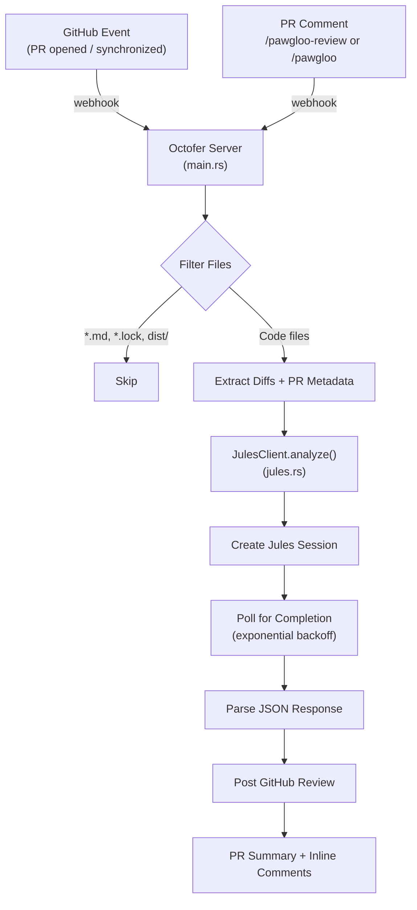

# Pawgloo Bot 🐾

> An intelligent GitHub App built in **Rust** that acts as a Senior Code Reviewer. It automatically reviews Pull Requests using **Google Jules**, focusing on security, logic, and clean code principles.

## Triggers

| Trigger    | Event                          | Behavior                                      |
| ---------- | ------------------------------ | --------------------------------------------- |
| **Auto**   | PR opened / new commits pushed | Reviews every new or updated PR automatically |
| **Manual** | `/pawgloo-review` comment      | Re-reviews on demand                          |
| **Manual** | `/pawgloo` comment             | Re-reviews on demand (shorthand)              |

## Setup

```sh
# Build
cargo build --release

# Run
cargo run
```

## Configuration

Copy `.env.example` to `.env` and fill in:

| Variable                    | Description                                                  |
| --------------------------- | ------------------------------------------------------------ |
| `GITHUB_APP_ID`             | Your GitHub App ID (numeric)                                 |
| `GITHUB_PRIVATE_KEY_BASE64` | Your GitHub App private key (Base64 encoded)                 |
| `GITHUB_WEBHOOK_SECRET`     | Webhook secret (set on GitHub App settings)                  |
| `OCTOFER_PORT`              | _(Optional)_ Port to listen on, default: `8000`              |
| `JULES_API_KEY`             | API key from [jules.google](https://jules.google) → Settings |
| `JULES_MODE`                | _(Optional)_ `SPEED` (default) or `BALANCED`                 |
| `SESSION_TIMEOUT_MINUTES`   | _(Optional)_ Jules session timeout, default: `25`            |
| `IGNORE_PATTERNS`           | _(Optional)_ Comma-separated globs to skip                   |
| `MAX_PATCH_LENGTH`          | _(Optional)_ Max chars per file patch before skipping        |
| `SKIP_DRAFT_PRS`            | _(Optional)_ Set to `false` to review draft PRs              |

## How It Works



### Prompt Architecture

The prompt uses several advanced techniques from LLM code review research:

| Technique                 | Purpose                                                             |
| ------------------------- | ------------------------------------------------------------------- |
| **Adversarial Persona**   | Overrides RLHF sycophancy — no praising mediocre code               |
| **STRIDE Threat Model**   | Spoofing, Tampering, Info Disclosure, Elevation of Privilege        |
| **Chain-of-Thought**      | `analysis_scratchpad` forces step-by-step reasoning before findings |
| **Big O Justification**   | Performance suggestions require explicit complexity analysis        |
| **Dependency Constraint** | Fixes must use only native language features                        |

### Review Categories

| Category       | What It Catches                                              |
| -------------- | ------------------------------------------------------------ |
| **SECURITY**   | Secrets, injection, auth bypass, IDOR, dev backdoors         |
| **LOGIC**      | Bugs, off-by-one, null deref, race conditions, edge cases    |
| **CLEAN CODE** | DRY/SOLID violations, N+1 queries, memory leaks, YAGNI bloat |

## Project Structure

```
src/
├── main.rs       # Octofer app setup, event handler registration
├── config.rs     # Environment variable parsing (BotConfig)
├── handlers.rs   # pull_request and issue_comment event handlers
├── jules.rs      # Jules API client (session, polling, parsing)
└── review.rs     # Core review pipeline (diff, filter, prompt, post)
```

## Docker

```sh
docker build -t pawgloo-bot .
docker run \
  -e GITHUB_APP_ID=<id> \
  -e GITHUB_PRIVATE_KEY_BASE64="<base64>" \
  -e GITHUB_WEBHOOK_SECRET=<secret> \
  -e JULES_API_KEY=<key> \
  pawgloo-bot
```

## Built With

- [Octofer](https://github.com/pawgloo/octofer) — Rust framework for GitHub Apps
- [Google Jules](https://jules.google) — AI code review engine
- [Tokio](https://tokio.rs) — Async runtime

## License

[ISC](LICENSE) © 2026 gaurav2361
