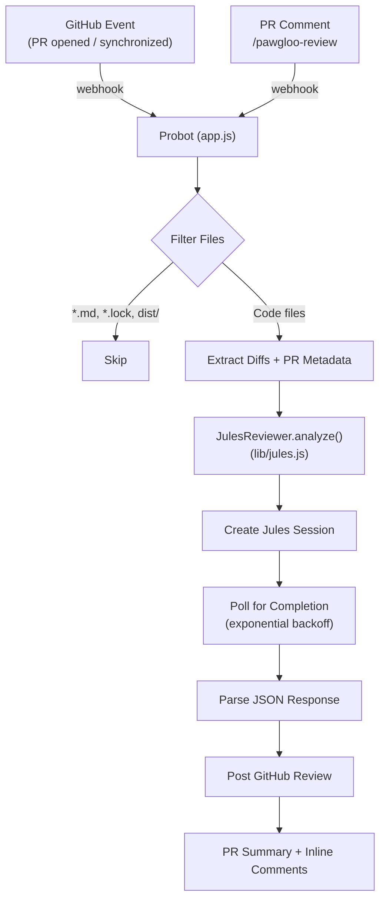

# bot

> An intelligent GitHub App that acts as a Senior Code Reviewer. It automatically reviews Pull Requests using **Google Jules**, focusing on security, logic, and clean code principles. Trigger it automatically on PRs or manually with `/pawgloo-review`.

## Setup

```sh
# Install dependencies
npm install

# Run the bot
npm start
```

## Configuration

Copy `.env.example` to `.env` and fill in:

| Variable            | Description                                                            |
| ------------------- | ---------------------------------------------------------------------- |
| `APP_ID`            | Your GitHub App ID                                                     |
| `PRIVATE_KEY`       | Your GitHub App private key                                            |
| `WEBHOOK_SECRET`    | Webhook secret (set on GitHub App settings)                            |
| `WEBHOOK_PROXY_URL` | Smee.io URL for local dev                                              |
| `JULES_API_KEY`     | API key from [jules.google](https://jules.google) → Settings           |
| `IGNORE_PATTERNS`   | _(Optional)_ Comma-separated globs to skip (default: `docs/,*.md,...`) |
| `MAX_PATCH_LENGTH`  | _(Optional)_ Max chars per file patch before skipping                  |

## Triggers

| Trigger   | How                                                         |
| --------- | ----------------------------------------------------------- |
| Automatic | Opens a PR or pushes new commits                            |
| Automatic | Opens a PR or pushes new commits                            |
| Manual    | Comment `/pawgloo-review` on any PR (works on old PRs too!) |

## How It Works

The bot listens for PR events, extracts file diffs, and sends them to **Google Jules** with a research-backed prompt engineered for maximum signal-to-noise ratio.



### Prompt Architecture

The prompt uses several advanced techniques from LLM code review research:

#### 1. Adversarial Persona Anchoring

> _"You are a fiercely pragmatic Principal Engineer and a paranoid Security Researcher. You have zero tolerance for over-engineering, unhandled edge cases, and security vulnerabilities."_

This overrides RLHF sycophancy — the model won't praise mediocre code or soften critiques.

#### 2. STRIDE Security Framework

Issues are evaluated against the full STRIDE threat model:

| Category                   | Focus                                          |
| -------------------------- | ---------------------------------------------- |
| **Spoofing**               | Auth bypass, weak sessions, token validation   |
| **Tampering**              | Mass assignment, XSS, insecure deserialization |
| **Info Disclosure**        | Hardcoded secrets, PII in logs, stack traces   |
| **Elevation of Privilege** | IDOR, missing RBAC, dev backdoors              |

Each security finding includes an **attack narrative** — exactly how a threat actor would exploit it.

#### 3. Chain-of-Thought Reasoning

The `analysis_scratchpad` field forces step-by-step reasoning _before_ generating findings:

- Trace data flow and trust boundaries
- Identify where untrusted input enters
- Evaluate structural integrity and coupling
- Reason about edge cases and failure modes

#### 4. Big O Mathematical Justification

Performance suggestions require explicit complexity analysis:

> _"You MUST state the Time (Big O) and Space complexity of the current vs. proposed implementation."_

#### 5. Dependency Constraint

> _"All fixes must use ONLY native language features. FORBIDDEN from introducing new external dependencies."_

#### 6. Review Categories

| Category       | What It Catches                                                         |
| -------------- | ----------------------------------------------------------------------- |
| **SECURITY**   | Secrets, injection, auth bypass, IDOR, dev backdoors                    |
| **LOGIC**      | Bugs, off-by-one, null deref, race conditions, edge cases (n-1, n, n+1) |
| **CLEAN CODE** | DRY/SOLID violations, N+1 queries, memory leaks, YAGNI bloat            |

### Output Format

- **PR Summary** — Purpose, Architecture (with `mermaid` diagrams), Code Quality, Risks, Verdict
- **Inline Comments** — Posted on exact lines with `category`, `severity`, and fenced code block suggestions:

**[SECURITY]** (CRITICAL): The `UPDATABLE_FIELDS` set includes `is_verified`.
A user can self-verify by sending `{"is_verified": true}`.

```python
UPDATABLE_FIELDS = {"city", "state", "zip", "bio"}  # removed is_verified
```

## Docker

```sh
docker build -t bot .
docker run -e APP_ID=<id> -e PRIVATE_KEY=<pem> -e WEBHOOK_SECRET=<secret> -e JULES_API_KEY=<key> bot
```

## License

[ISC](LICENSE) © 2026 gaurav2361
